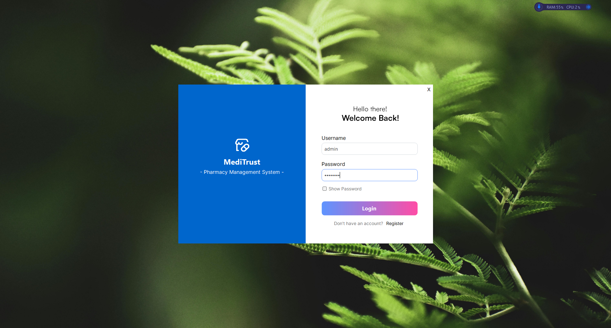
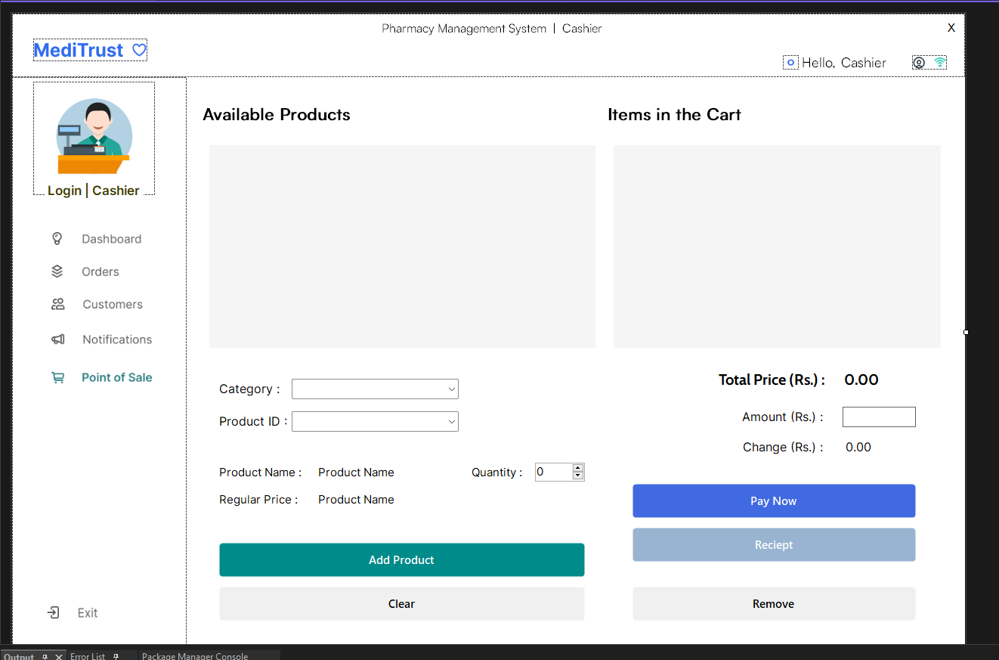
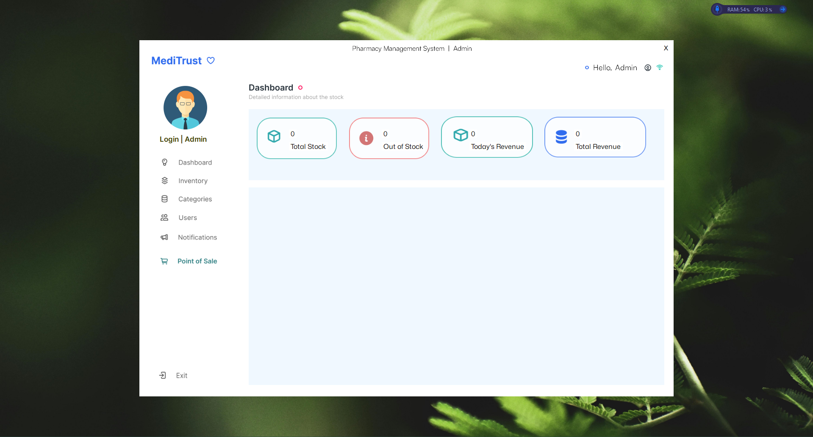
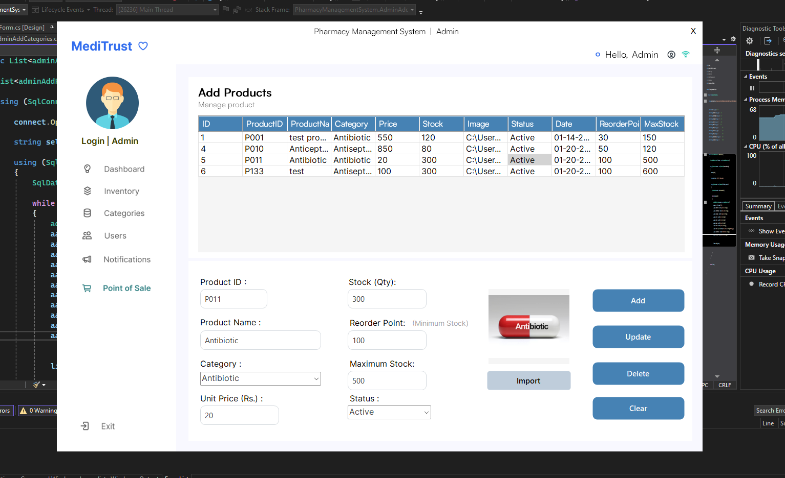

# 🏥 Pharmacy Inventory Management System

<p align="center">
  
  
  
  
</p>

---

## 📌 Overview

The **Pharmacy Inventory Management System** is a standalone desktop application designed to streamline pharmacy operations by efficiently managing **users, authentication, inventory, and sales processes**.

The system is developed following **Rapid Application Development (RAD)** principles, emphasizing fast prototyping, iterative improvements, and early delivery of functional components.

The user interface was initially designed using **Figma** to ensure a clean, intuitive, and user friendly experience before full implementation.

---

## 🖼️ Project Screenshots

<p align="center">
  
  
</p>

<p align="center">
  
  
</p>

---

## 🛠️ Technologies Used


  * **Programming Language**: C# 
  * **Framework**: .NET, GunaUI 
  * **IDE**: Visual Studio 
  * **Database**: SQL-based local database 
  * **UI Designing**: Figma


---

## 🔄 System Workflow

1. User launches the application
2. Authentication via login or registration
3. Admin approval for new users
4. Role based access to system modules
5. Inventory monitoring, sales handling, and reporting

---

## 📐 Development Methodology

* 🚀 Rapid Application Development (RAD)
* 🔁 Iterative prototyping
* 💬 Continuous user feedback
* ⚙️ Early implementation of core features

---

## ⚙️ Core Functions

* 📦 Inventory management
* 📉 Stock level monitoring with alerts
* 👥 Role based access control
* 💰 Sales and billing management
* 📊 Reports and analytics dashboard
* 🔐 Secure authentication with password hashing and encryption

---

## 🚀 Getting Started

1. Clone the repository

   ```bash
   git clone https://github.com/your-username/pharmacy-inventory-management-system.git
   ```
2. Open the solution file in **Visual Studio**
3. Configure the database connection
4. Build and run the application

---

## 📎 Additional Notes

* Designed as an academic and practical learning project
* Focuses on real world pharmacy workflows
* Built with scalability and maintainability in mind

---
